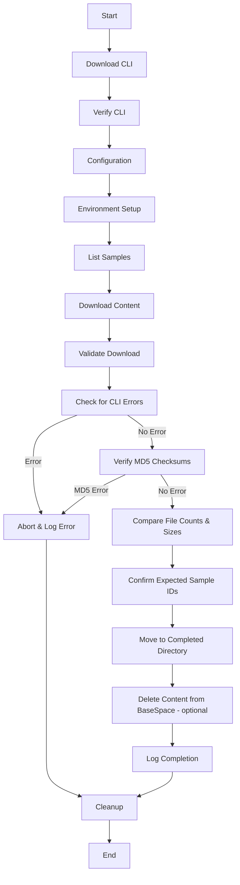

## Windows Batch Automation for BaseSpace Sync

This repository includes a Windows batch script (`bs_sample.cmd`) that automates daily synchronization of BaseSpace project data. The workflow includes:

1. **Installation**
   - Downloads the latest BaseSpace CLI executable (`bs.exe`) to a working directory using PowerShell.
   - Verifies the executable is functional before proceeding.

2. **Configuration**
   - Sets API key, project ID, and local paths for downloads, completed files, logs, and expected samples.

3. **Environment Setup**
   - Creates necessary configuration files and directories for BaseSpace CLI operation.

4. **Sample Listing**
   - Lists available samples in the specified BaseSpace project using the downloaded CLI.
   - Logs the sample list and checks for errors.

5. **Content Download**
   - Downloads new or updated content from the BaseSpace project.
   - Logs the download process and checks for errors.

6. **Validation**
   - Checks for CLI errors in logs.
   - Verifies MD5 checksums for downloaded files.
   - Compares file counts and sizes against expected values.
   - Confirms expected sample IDs are present.

7. **Post-Processing**
   - Moves downloaded samples to a completed directory.
   - (Optional) Deletes content from BaseSpace after validation.

8. **Completion & Cleanup**
   - Logs completion of the sync process.
   - Removes the downloaded CLI executable from the working directory.
   - Cleans up sensitive environment variables and temporary files.

---

### Visual Workflow

---

For Linux and Mac, see the shell commands above for direct CLI download instructions.